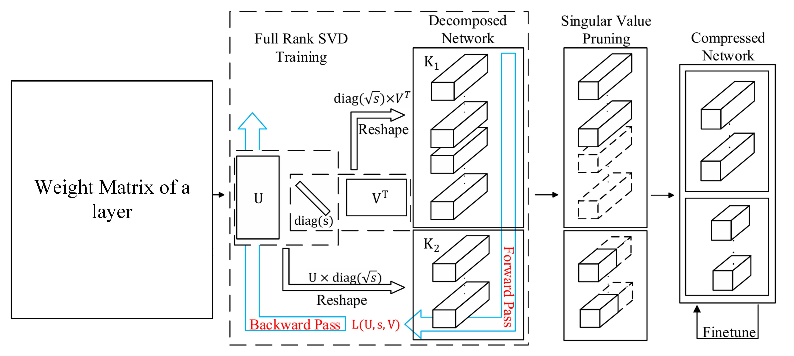

# Low Rank Training of Deep Neural Networks (DNNs)

---

## 1. Team Members

| Name | Roll Number |
|---|---|
| Nakka Saampotth Maddileti | CB.SC.U4AIE24233 |
| Nimmagadda Kesav Satya Sai | CB.SC.U4AIE24236 |
| Gnana Vikas Sai Pabbathi | CB.SC.U4AIE24238 |
| Vemula Poorna Chandra | CB.SC.U4AIE24258 |

---

## 2. Base paper

**Low-Rank Training of Deep Neural Networks**  
Paper link: https://arxiv.org/abs/2004.09031

This paper proposes training neural networks directly in a low-rank parameterized form using singular value decomposition (SVD), enabling model compression and reduced computational cost during training itself.

---

## 3. Project Outline

Modern deep neural networks are computationally expensive and memory-intensive, making deployment on edge and resource-constrained devices challenging. Although trained weight matrices often exhibit low-rank structure, conventional training does not explicitly control or exploit this property.

In this project, we implement low-rank training of neural networks using SVD-based parameterization, where each fully connected layer is represented directly by its singular vectors and singular values instead of full weight matrices. The model is trained on these SVD components without performing repeated decompositions during training, while enforcing orthogonality constraints on the singular vectors and sparsity constraints on the singular values to preserve SVD properties and encourage a low effective rank.

Experiments are conducted on the MNIST dataset using a standard DNN architecture and its SVD-modified counterpart. The performance is evaluated in terms of accuracy, loss convergence, and parameter reduction, demonstrating the trade-off between compression and predictive performance.

---
## Process Flow

## Our Architecture for the project(Standard DNN)
$$
\textbf{Input Layer: } 28 \times 28 \text{ grayscale image flattened to a vector } x \in \mathbb{R}^{784}
$$

$$
\textbf{Hidden Layer 1: }
W_1 \in \mathbb{R}^{128 \times 784}, \quad
z_1 = W_1 x + b_1, \quad
a_1 = \mathrm{ReLU}(z_1)
$$

$$
\textbf{Hidden Layer 2: }
W_2 \in \mathbb{R}^{64 \times 128}, \quad
z_2 = W_2 a_1 + b_2, \quad
a_2 = \mathrm{ReLU}(z_2)
$$

$$
\textbf{Output Layer: }
W_3 \in \mathbb{R}^{10 \times 64}, \quad
z_3 = W_3 a_2 + b_3, \quad
\hat{y} = \mathrm{Softmax}(z_3)
$$

---

## Forward Pass
$$
\begin{aligned}
z_1 &= W_1 x + b_1, & a_1 &= \text{ReLU}(z_1) \\
z_2 &= W_2 a_1 + b_2, & a_2 &= \text{ReLU}(z_2) \\
z_3 &= W_3 a_2 + b_3, & \hat{y} &= \text{Softmax}(z_3)
\end{aligned}
$$

---

## Loss function for standard DNN
$$
\mathcal{L} = - \sum_{k=1}^{10} y_k \log(\hat{y}_k)
$$

Weights are updated using gradient descent

---

## Loss function for SVD-Modified DNN
$$
\mathcal{L} =
\mathcal{L}_{CE}
+
\lambda_{orth}
\left(
\left\| U^{T}U - I \right\|_{F}^{2}
+
\left\| V^{T}V - I \right\|_{F}^{2}
\right)
+
\lambda_{sparse}
\frac{\left\|\Sigma\right\|_{1}}{\left\|\Sigma\right\|_{2}}
$$

---

## 4. Update-1

Ran simulations changing learning rate, lambda_ortho parameters
Below is the table of the recorded accuracies at different parameters

| Lambda_ortho ↓ \ LR → | 1e-1           | 1e-2                     | 1e-3   | 1e-4   | 1e-5   | 1e-6   |
| --------------------- | -------------- | ------------------------ | ------ | ------ | ------ | ------ |
| **1e-1**              | 9.8% (Overfit) | 93.03% (highly unstable) | 93.37% | 86.35% | 64.07% | 31.85% |
| **1e-2**              | 9.8% (Overfit) | 9.8% (Overfit)           | 93.41% | 87.14% | 64.26% | 31.82% |
| **1e-3**              | 9.8% (Overfit) | 9.8% (Overfit)           | 94.86% | 87.18% | 64.27% | 31.83% |
| **1e-4**              | 9.8% (Overfit) | 93.75%                   | 94.78% | 87.18% | 64.29% | 31.83% |
| **1e-5**              | 9.8% (Overfit) | 93.30%                   | 94.80% | 87.16% | 64.29% | 31.83% |
| **1e-6**              | 9.8% (Overfit) | 92.81%                   | 94.74% | 87.81% | 64.29% | 31.83% |

For standard DNN,
| Learning Rate | Accuracy |
| ------------- | -------- |
| **1e-1**      | 97.74%   |
| **1e-2**      | 97.10%   |
| **1e-3**      | 74.17%   |
| **1e-4**      | 11.35%   |
| **1e-5**      | 11.35%   |
| **1e-6**      | 8.48%    |

---

## 5. Observations

- Standard DNN training is robust only above a critical learning-rate threshold (as expected)
- Compared to standard DNNs, SVD-based training is significantly more sensitive to learning-rate selection and operates within a much narrower range
- Strong orthogonality regularization destabilizes training at high learning rates
- Very small learning rates causes underfitting in SVD-based models
- Optimal SVD performance remains below standard DNN accuracy

---

## 6. Advice given after Update-1

1.
Generate a list of random number seeds by fixing the first seed.
MNIST digits, MNIST fashion, CIFAR 10.
Compare the results for how quick the loss function drops for SVD vs full weight matrix

2.
Combine SVD pruned and standard DNN training
Print the gradient (difference of loss function). Choose a threshold from here
Until the gradient falls below the threshold follow SVD pruning
After that switch over to standard DNN (full weight matrix) training.

3.
Understanding the loss function,
remove each term and show the result, loss function graph

---

## 7. Update-2
Implemented hybrid version of Standard DNN and SVD- modified DNN.
Implemented BiPIL version of SVD-Modified DNN for one shot learning.

---

## 8. Advice given after Update-2
Work on sudden spike in loss while changing from SvD-Modified to Standard version during hybrid training.
Work on different datasets.
Change criteria for switching from SVD to Standard DNN based on comparing loss of both methods.

---

## 9.Results
All the simulations have been performed in MATLAB 2024b on an Intel core i5 CPU

| Method | Dataset | Accuracy (%) | Time (s) |
|------|------|------|------|
| Standard DNN | MNIST | **97.10** | 172.09 |
| Standard DNN | Fashion-MNIST | **86.75** | 203.14 |
| SVD-Modified DNN | MNIST | 94.57 | 223.14 |
| SVD-Modified DNN | Fashion-MNIST | 84.64 | 204.09 |
| Hybrid Version | MNIST | 94.27 | **138.61** |
| Hybrid Version | Fashion-MNIST | 84.12 | **79.15** |

---
## 10.References
1. **Low-Rank Training of Deep Neural Networks**(Base paper), Paper link: https://arxiv.org/abs/2004.09031
2.  Bi-PIL: Bidirectional Gradient-Free Learning Scheme for Multilayer Neural Networks, IEEE TRANSACTIONS ON NEURAL NETWORKS AND LEARNING SYSTEMS, VOL. 36, NO. 9, SEPTEMBER 2025.
